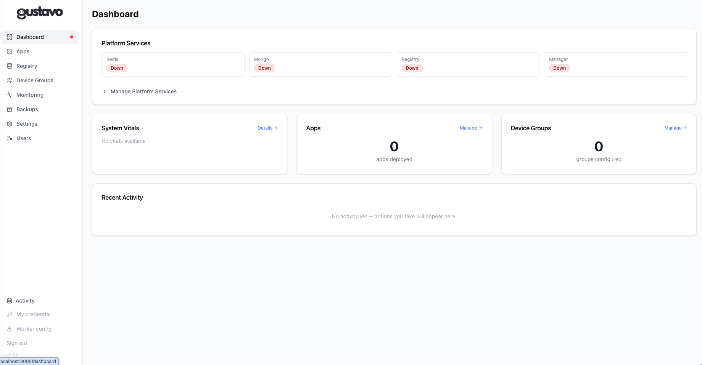
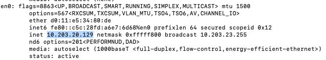
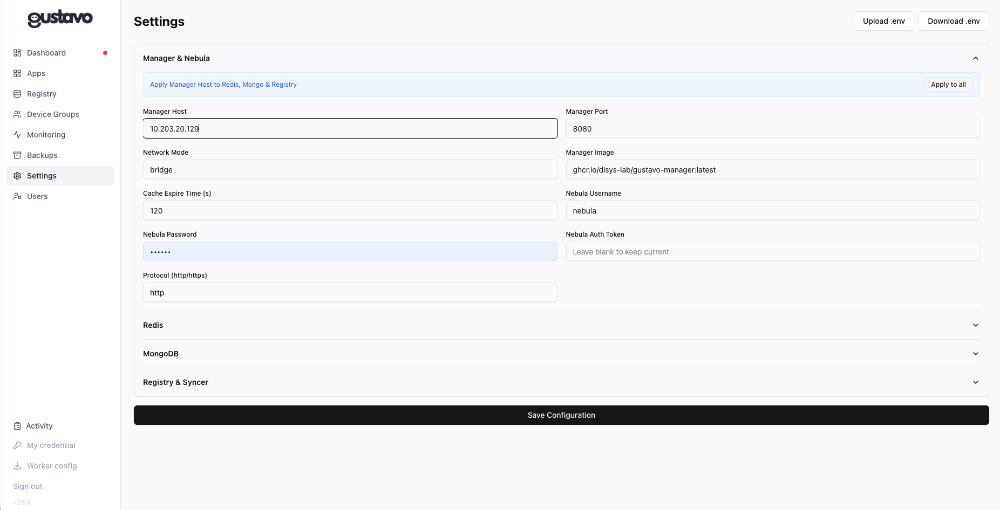
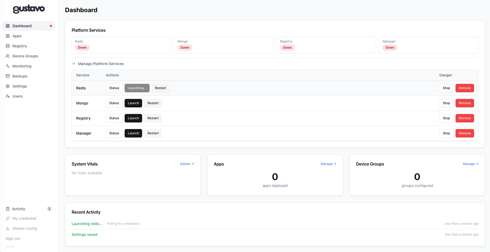
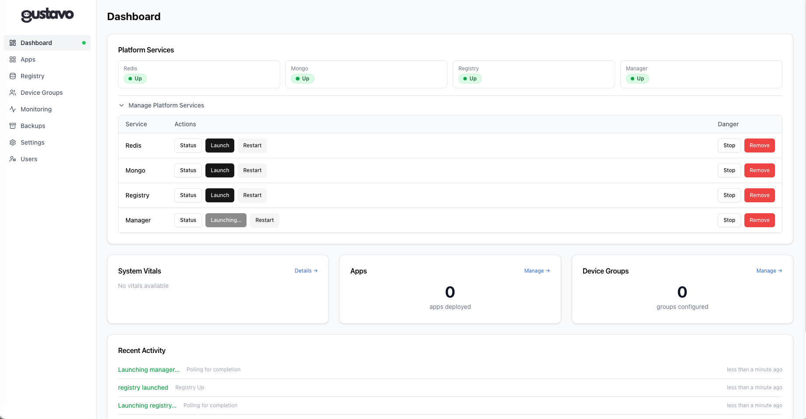
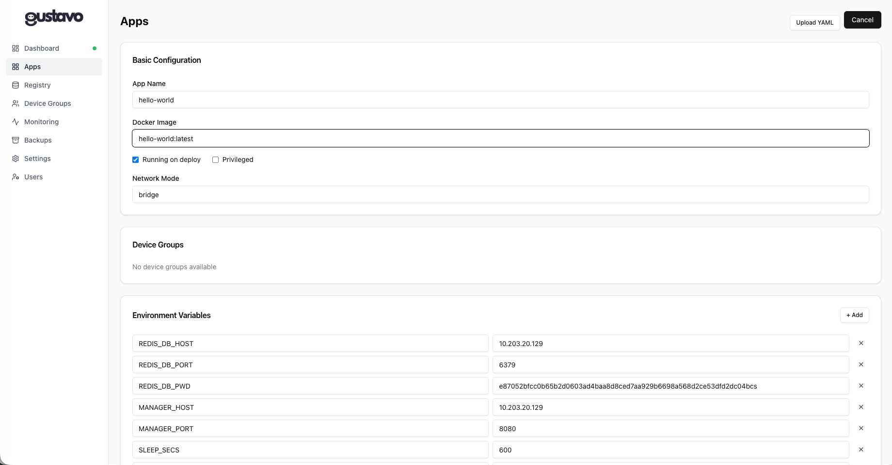
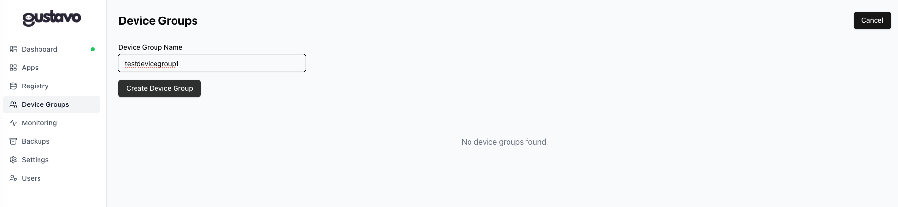
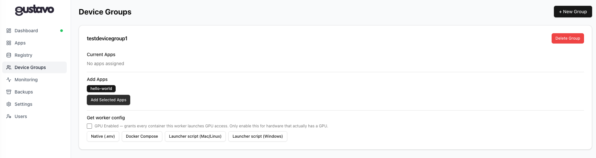
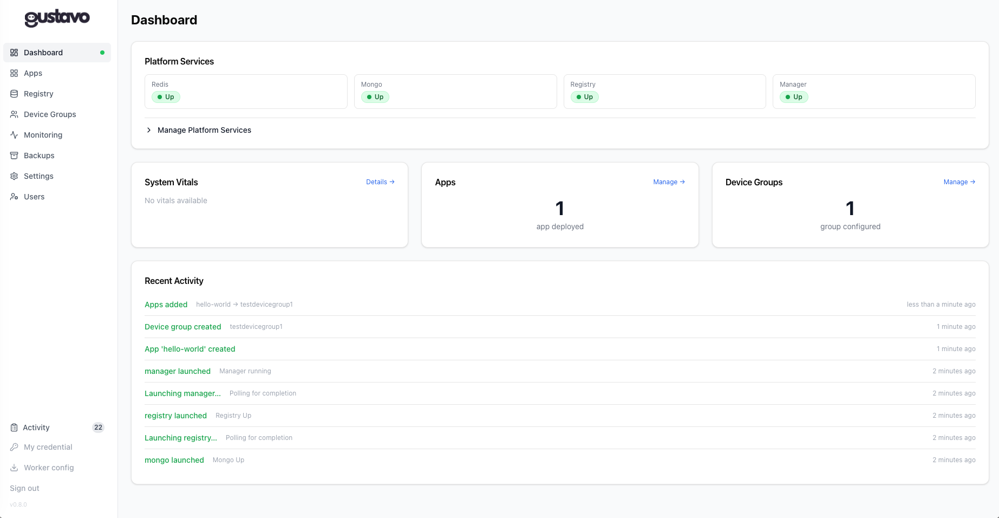
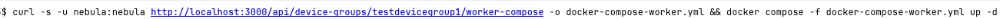

# Quickstart — Docker (Recommended)

Running Gustavo as a Docker container is the recommended approach. You get a self-contained image with the Next.js UI, FastAPI backend, and all Python dependencies pre-installed.

Everything below is done through the web UI once the container is running — no scripting knowledge needed, beyond typing the two commands in this first step and (later) one command to bring up a worker.

---

## Try it now

Open a terminal (macOS: Terminal / iTerm; Windows: PowerShell or the WSL terminal; Linux: your usual shell) and run:

```bash
curl -o docker-compose.yml https://raw.githubusercontent.com/disys-lab/gustavo/main/sample_config_files/docker-compose.quickstart.yml
docker compose up -d
```

This downloads a ready-made compose file and starts the Gustavo container — no existing Nebula platform required, login disabled, so you can look around the dashboard immediately.

Open [http://localhost:3000](http://localhost:3000). The first load may take a few seconds while FastAPI completes its health check.



This is expected. Nothing is running yet — the next steps bring each piece up, in order.

---

## Step 1 — Tell Gustavo how to reach itself

The four platform services (Redis, Mongo, Registry, Manager) run as their own Docker containers, and they need an address to find each other and the Gustavo container. On a single machine, the simplest address that works is **your computer's own local network IP**.

Find it in a terminal:

=== "macOS"
    ```bash
    ipconfig getifaddr en0
    ```
=== "Linux"
    ```bash
    hostname -I | awk '{print $1}'
    ```
=== "Windows (PowerShell)"
    ```powershell
    (Get-NetIPAddress -AddressFamily IPv4 -InterfaceAlias "Wi-Fi").IPAddress
    ```



Copy that address (it will look like `10.x.x.x` or `192.168.x.x`) — you'll paste it into the UI next.

In Gustavo, open **Settings**, and paste your IP into **Manager Host**:



Click **Apply Manager Host to Redis, Mongo & Registry** (the blue banner above the fields), then **Apply to all** — this copies the same address into the Redis, Mongo, and Registry host fields too, so every service uses one consistent address. Scroll down and click **Save Configuration**.

!!! note "Why not just leave the defaults?"
    Each service is its own container with its own internal Docker address, which changes every time it's recreated. Your machine's own network IP is stable and reachable from every container, which is why it's the simplest address to use for a single-machine setup like this.

---

## Step 2 — Launch the platform services

Back on the **Dashboard**, expand **Manage Platform Services** and click **Launch** on each service — **Redis**, **Mongo**, and **Registry** first, then **Manager** last (Manager depends on the other three, so give them a few seconds' head start).



Each launch is a background job — the button shows **Launching…** until it finishes, then the row's status pill turns green. Manager takes the longest to come up (it's initializing its own database), typically under a minute.



Wait until all four pills read **Up** before continuing.

---

## Step 3 — Create your first app

Go to **Apps** → **+ New App**. Give it a name and a Docker image — for a first try, `hello-world:latest` (a tiny public image that just prints a message and exits) is a good choice:



Notice the **Environment Variables** section is already pre-filled with the Redis/Manager connection details you set up in Step 1 — you don't need to re-type them. Leave **Running on deploy** checked and save.

---

## Step 4 — Create a device group and add the app to it

A **device group** is the set of machines an app is allowed to run on. Go to **Device Groups** → **+ New Group**, name it (e.g. `testdevicegroup1`), and click **Create Device Group**:



Once created, select the app you just made under **Add Apps** and click **Add Selected Apps**:



This same page has a **Get worker config** section — that's what the next step uses to actually run the app on a machine.

---

## Checkpoint — everything should now be live

Back on the **Dashboard**, you should see all four services **Up**, 1 app deployed, 1 device group configured, and a full trail of what just happened in **Recent Activity**:



At this point Gustavo itself is fully configured. The last piece is a **worker** — the thing that actually pulls and runs your app's container.

---

## Step 5 — Bring up a worker

A worker is a small background process that connects to Gustavo, picks up any apps assigned to its device group, and runs them as real Docker containers. You can run one on the same machine for local testing, or on any other machine that can reach this one.

There are two ways to get a worker running, depending on your comfort with the command line:

### Option A — download and double-click (no typing required)

On the Device Groups page's **Get worker config** section (shown in Step 4), click one of:

- **Launcher script (Mac/Linux)** — downloads a `.command` file. Double-click it in Finder to run it (macOS may ask you to confirm it's safe to open the first time).
- **Launcher script (Windows)** — downloads a `.bat` file. Double-click it in File Explorer.

Either one starts the worker with everything already filled in — no editing, no terminal.

### Option B — one command in a terminal

If you're already in a terminal, this is the fastest path. The quickstart container has login disabled and uses the default credentials `nebula:nebula`, so the same command shown below will work as-is if you've been following along:

```bash
curl -s -u nebula:nebula http://localhost:3000/api/device-groups/testdevicegroup1/worker-compose -o docker-compose-worker.yml && docker compose -f docker-compose-worker.yml up -d
```



Replace `testdevicegroup1` with whatever you actually named your device group. If you're running this from a different machine than Gustavo itself, replace `localhost:3000` with that machine's address and port.

```
✓ Container worker_testdevicegroup1 Started
```


Either option ends the same way: open Docker Desktop (or run `docker ps`) and you'll see the app's image being pulled and started:


That's it — the worker picked up `hello-world` from its device group and ran it. Any app you add to `testdevicegroup1` from now on will run the same way, automatically, the next time the worker checks in.

!!! tip "GPU access"
    To grant a worker GPU access, check the **GPU Enabled** box on the Device Groups page before downloading (Option A), or add `?gpu=true` to the URL (Option B) — only do this on hardware that actually has a GPU `nvidia-container-toolkit` can expose.

See [gustavo worker](cli/worker.md) for the full CLI reference, and [Device Groups UI](ui/device-groups.md#get-worker-config) for more on the other download formats (native `.env` for advanced/custom setups).

---

## Full setup

The rest of this page covers a production-style setup against a real, separately-hosted Nebula platform, rather than the all-in-one trial above. If you followed "Try it now", stop the trial container first (`docker compose down`).

### Prerequisites

- Docker Engine 20.10 or later
- Docker Compose v2 (`docker compose` command)
- A running [Nebula Manager](https://nebula-orchestrator.github.io/) with accessible API

See [Deployment](deployment.md) for complete configuration examples, including [minimal setup](deployment.md#minimal-setup) and [production with authentication](deployment.md#production).

### Step 1 — Create the configuration directory

Gustavo persists its platform configuration to a YAML file mounted from the host:

```bash
mkdir -p ./config
```

Optionally pre-seed it with a `platform.yaml`.

### Step 2 — Create `docker-compose.yml`

See [Deployment](deployment.md#minimal-setup) for a minimal example, or [Deployment with authentication](deployment.md#production) for production-ready settings.

### Step 3 — Start Gustavo

```bash
docker compose up -d
```

Open [http://localhost:3000](http://localhost:3000).

### Authentication (optional)

To require login, see [Deployment with authentication](deployment.md#production).

---

## Next steps

- [End-to-End Tutorial](tutorial.md) — deploy apps to edge devices
- [Configuration Reference](configuration.md) — tune Redis expiry, network modes, and image versions
- [Native Installation](installation.md) — run Gustavo natively without Docker

---

## Building the image locally

If you want to build from source:

```bash
git clone https://github.com/disys-lab/gustavo.git
cd gustavo
docker build -t gustavo:local .
docker compose up -d
```

See [Build arguments](deployment.md#build-arguments) for customization options.

---

## Updating

```bash
docker compose pull
docker compose up -d
```

Configuration in `./config/platform.yaml` is preserved across updates.

---

## Stopping and removing

```bash
docker compose down        # Stop (preserves config volume)
docker compose down -v     # Stop and remove everything including config volume
```
