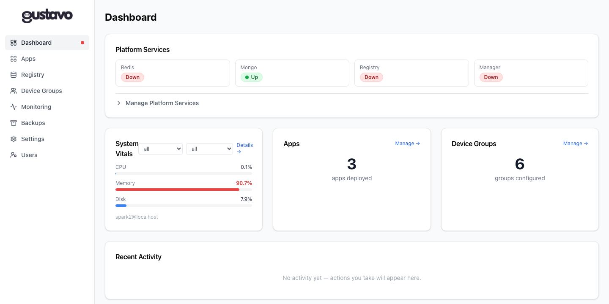

# Dashboard

The Dashboard is the landing page after login. It provides an at-a-glance view of the platform state.

---

## Layout

Top to bottom: the Platform Services card (status pills + expandable
management table), a 3-column row (System Vitals, Apps, Device
Groups), and Recent Activity. In this screenshot only Mongo shows
`Up` — Redis/Registry/Manager status is a local Docker container-name
lookup on the machine `gustavo` itself runs on (see the Platform
Services card section below), so it doesn't reflect those services
being reachable elsewhere.

---

## Platform Services card

Always visible. Shows a status pill for each of the 4 platform services (Redis, MongoDB, Registry, Manager).

- **Green pulsing dot** — service is `Up`
- **Red dot** — service is `Down`
- **Gray** — status unknown (loading)

"Up"/"Down" is a local Docker container-name lookup (`docker
containers.get("redis")`/`"registry"`/`"manager"`/`"mongo"`) against
whatever Docker daemon the `gustavo` container's mounted
`/var/run/docker.sock` points at — **not** a network reachability
check against `REDIS_HOST`/`MANAGER_HOST`/etc. If a service actually
runs as a container on a different host than `gustavo` itself, its
pill shows `Down` even though the service is healthy — the pill only
finds services running on `gustavo`'s own Docker host.

The status strip auto-refreshes every 30 seconds. Clicking **Status** in the expanded table forces an immediate refresh and updates the strip.

### Manage Platform Services (expandable)

Click the `▶ Manage Platform Services` toggle to expand a table with action buttons:

| Column | Actions |
|--------|---------|
| Primary | **Status**, **Launch**, **Restart** |
| Danger | **Stop**, **Remove** (with confirmation) |

**Launch** is a background operation — a spinner appears while the job is pending, then the status pill updates. **Stop** and **Remove** show a confirmation dialog before executing.

---

## System Vitals card

Shows live CPU, memory, and disk usage from worker nodes via the SSE monitoring stream. A drop-down lets you filter by device group and host.

Threshold colors:
- **Red** ≥ 80%
- **Yellow** ≥ 50%
- **Blue** < 50%

---

## Apps and Device Groups cards

Count of deployed apps and configured device groups. Click **Manage →** to navigate to the respective page.

---

## Recent Activity

The last 8 actions taken in the current session (launches, saves, errors). Sourced from the in-memory activity log (`lib/activityLog.ts`). Click the history icon in the sidebar footer to see the full log.

---

## Sidebar health dot

The Dashboard link in the sidebar shows a small dot:
- **Green** — all 4 services (Redis, MongoDB, Registry, Manager) are `Up`
- **Red** — at least one service is down
- **Gray** — status not yet loaded
